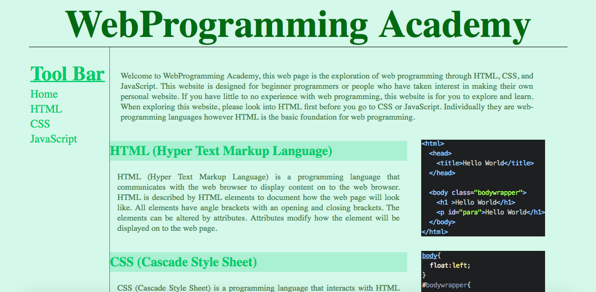
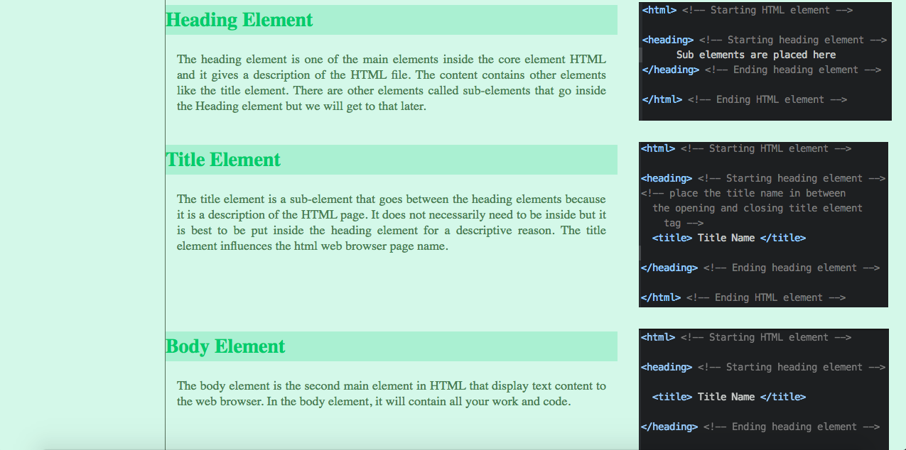

# WebProgramming Academy

http://jasonyang1992.github.io/WPA-site

WebProgramming Academy is a website created by Jason Yang as a simple tutorial website
that explores HTML, CSS, and Javascript. The purpose is to share some knowledge of WebProgramming
using these three languages.

